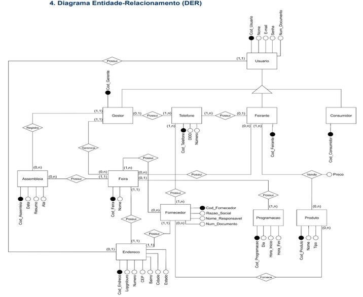
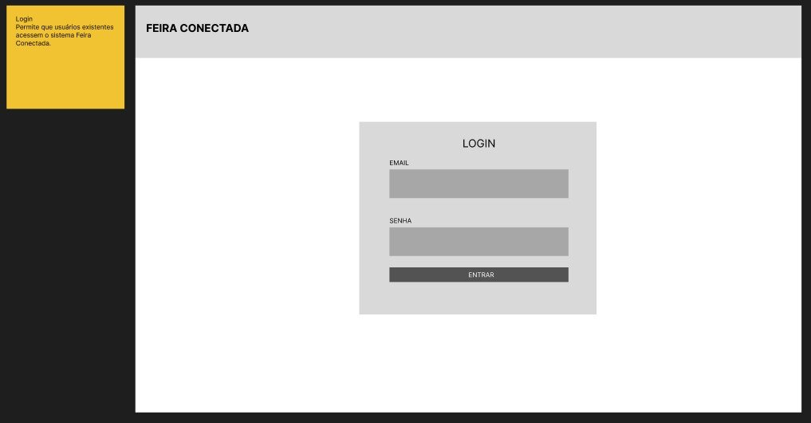
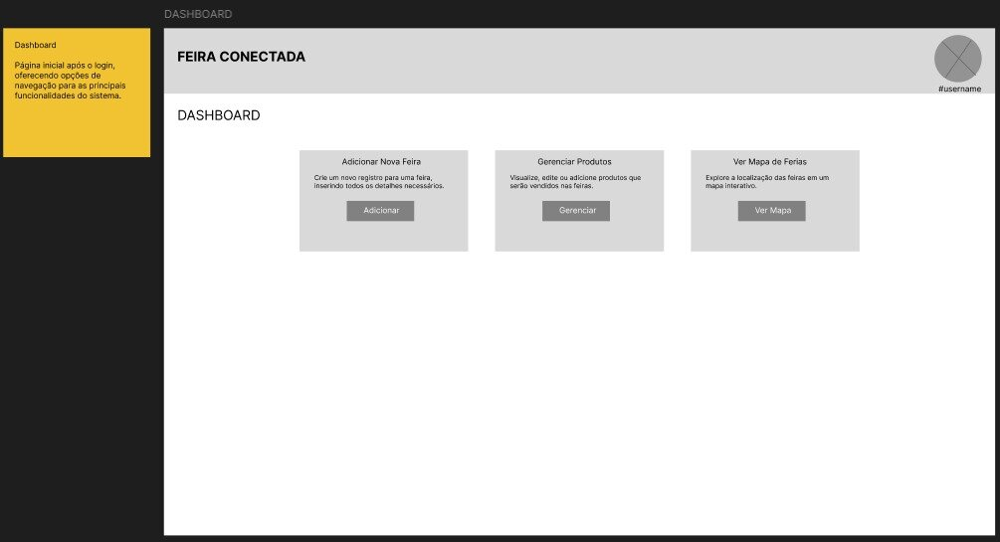
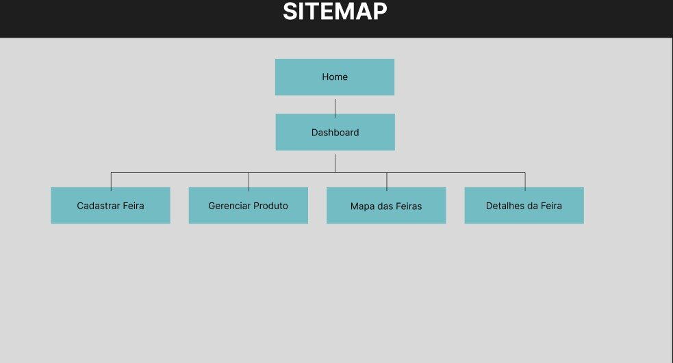

# 🎯 Projeto Integrado II - Feira Conectada

**Universidade Federal do Cariri (UFCA)**  
**Análise e Desenvolvimento de Sistemas (ADS)**  
**Disciplina:** PROJETO INTEGRADO II [ADS0013]  
**Professor:** Prof. Allysson Allex Araújo

---

## 👥 Equipe

| Nome | Matrícula |
|------|-----------|
| Jefferson Rodrigues de Oliveira | 2025013432 |
| Lucas Gabriel Correia Gonçalves | 2025013479 |
| Luiz Filipy Soares da Silva | 2025013503 |
| Marcelo dos Santos Alves | 2023010825 |
| Weber Fernandes da Silva | 2025019356 |

---

## 📐 Wireframe

O wireframe do projeto **Feira Conectada** foi construído com base nas principais funcionalidades identificadas na análise do Diagrama Entidade-Relacionamento (DER). Este wireframe serve como base visual para a interface do sistema, orientando o desenvolvimento das telas.

> 🔗 **Acesse o projeto completo no Figma:** [Clique aqui para visualizar o wireframe interativo](https://www.figma.com/design/rmTPJuuExV4fdn4q1z6LG9/Projeto-Integrado-II---Feira-Conectada?node-id=0-1&t=ja7xoN7ShYJGpKHy-1)

### Principais Funcionalidades

#### 1. Login
Autenticação de usuários no sistema.

#### 2. Dashboard
Visualização geral e controle central da plataforma.

#### 3. Adicionar Nova Feira
Cadastro de novas feiras na plataforma.

#### 4. Gerenciar Produtos
Administração de produtos disponíveis nas feiras.

#### 5. Ver Mapa de Feiras
Visualização geográfica das feiras cadastradas.

#### 6. Ver Detalhes da Feira
Acesso às informações específicas de cada feira.

---

## 🗺️ Sitemap

O sitemap apresenta a estrutura hierárquica e a navegação do projeto, mapeando todas as páginas e fluxos de interação do sistema.

---

## 🎨 Design Centrado no Usuário e Prototipagem de Wireframes

### O que é Design Centrado no Usuário?

O **Design Centrado no Usuário (DCU)** é uma abordagem fundamental no desenvolvimento de sistemas que coloca as necessidades, expectativas e limitações dos usuários finais no centro do processo de design. Diferentemente de abordagens tradicionais focadas apenas em funcionalidades técnicas, o DCU reconhece que um sistema bem desenvolvido é aquele que as pessoas conseguem usar de forma intuitiva, eficiente e satisfatória.

### Como Prototipar um Wireframe: Guia Prático

Um wireframe é uma representação esquemática e de baixa fidelidade da interface do sistema, servindo como base para o desenvolvimento. Para prototipar um wireframe eficaz, seguimos os seguintes passos:

#### 1. **Pesquisa e Análise de Requisitos**
- Realizar entrevistas com usuários finais para entender suas necessidades
- Analisar o fluxo de trabalho e as tarefas que serão executadas
- Identificar as funcionalidades-chave do sistema

#### 2. **Definição da Estrutura**
- Mapear o sitemap da aplicação (hierarquia de páginas)
- Estabelecer a arquitetura da informação
- Definir os fluxos de navegação entre telas

#### 3. **Esboço das Telas**
- Começar com desenhos em papel ou ferramentas digitais simples
- Organizar elementos de forma lógica e intuitiva
- Manter o foco em layout e usabilidade, não em estética

#### 4. **Organização de Elementos**
- Colocar elementos de destaque em posições estratégicas
- Agrupar funcionalidades relacionadas
- Garantir que as ações mais frequentes sejam facilmente acessíveis

#### 5. **Feedback e Iteração**
- Compartilhar protótipos com usuários e stakeholders
- Coletar feedback sobre clareza e usabilidade
- Refinar e melhorar iterativamente com base nas sugestões

#### 6. **Validação**
- Testar o wireframe com usuários reais se possível
- Verificar se todos os requisitos foram contemplados
- Garantir que o fluxo de navegação faz sentido

### Impacto do Design na Qualidade dos Sistemas

A qualidade de um sistema não depende apenas de eficiência técnica, mas fundamentalmente de como ele se relaciona com as pessoas que o utilizam. Quando adotamos uma perspectiva centrada no usuário, melhoramos significativamente diversos aspectos:

#### **Usabilidade e Eficiência**
Um design bem pensado reduz o tempo necessário para realizar tarefas e minimiza erros. Usuários conseguem completar suas ações com menos cliques, menos confusão e maior segurança. No caso do Feira Conectada, um dashboard intuitivo permite que vendedores gerenciem suas feiras rapidamente, aumentando sua produtividade.

#### **Satisfação e Experiência**
Interfaces mal projetadas causam frustração, abandono do sistema e insatisfação. Quando um sistema é fácil e agradável de usar, os usuários têm experiências positivas e tendem a usar a plataforma com mais frequência. Uma boa experiência cria fidelização e confiança.

#### **Acessibilidade e Inclusão**
Design centrado no usuário considera pessoas com diferentes perfis: desde experientes até iniciantes, pessoas com deficiências visuais ou motoras. Um sistema acessível é utilizado por um público maior e demonstra responsabilidade social.

#### **Redução de Custos de Suporte**
Quando um sistema é intuitivo, menos usuários precisam de auxílio para utilizá-lo. Isso reduz significativamente os custos com suporte técnico, documentação e treinamento.

### A Interface Humano-Computador e seu Impacto na Sociedade

A **Interface Humano-Computador (IHC)** é a pont entre pessoas e máquinas. Cada decisão de design, cada botão posicionado, cada cor escolhida, afeta como bilhões de pessoas interagem com tecnologia diariamente. Esse impacto vai muito além da experiência individual:

#### **Inclusão Digital**
Interfaces bem projetadas reduzem a barreira de entrada para a tecnologia. Pessoas idosas, com baixa escolaridade ou com deficiências conseguem acessar serviços digitais quando os sistemas são pensados para todos. Isso promove inclusão digital e reduz desigualdades.

#### **Empoderamento Econômico**
Sistemas como o Feira Conectada, quando bem projetados, empoderam pequenos negócios. Vendedores ambulantes, agricultores e pequenos comerciantes conseguem se organizar, se conectar com clientes e expandir seus negócios através de uma plataforma intuitiva.

#### **Saúde e Bem-estar**
Aplicações de saúde, telemedicina e bem-estar dependem completamente de interfaces que as pessoas confiam e conseguem usar. Um design ruim nessas aplicações pode resultar em diagnósticos errados ou abandono do tratamento.

#### **Democracia e Transparência**
Plataformas de participação democrática, transparência governamental e acesso a informações públicas precisam ser intuitivas. Quando são complexas ou confusas, excluem cidadãos do processo democrático.

#### **Sustentabilidade**
Interfaces eficientes consomem menos energia, reduzem desperdício digital e promovem comportamentos mais sustentáveis. Um design pensado em sustentabilidade impacta o meio ambiente globalmente.

### Compromisso com o Projeto

No desenvolvimento do **Feira Conectada**, aplicamos estes princípios do Design Centrado no Usuário, garantindo que a plataforma seja:

✅ **Intuitiva** - Fácil de aprender e usar para qualquer pessoa  
✅ **Acessível** - Utilizável por pessoas com diferentes perfis e limitações  
✅ **Eficiente** - Reduz tempo e esforço nas tarefas do dia a dia  
✅ **Segura** - Protege dados e oferece segurança aos usuários  
✅ **Impactante** - Promove inclusão social e empoderamento econômico

O wireframe apresentado neste projeto reflete esse compromisso, servindo de fundação para um sistema que verdadeiramente serve e valoriza seus usuários.